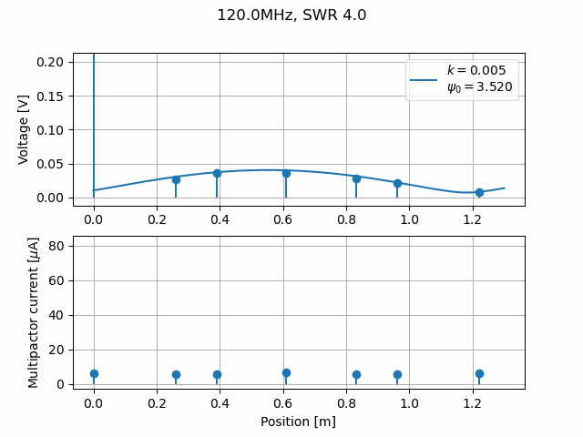
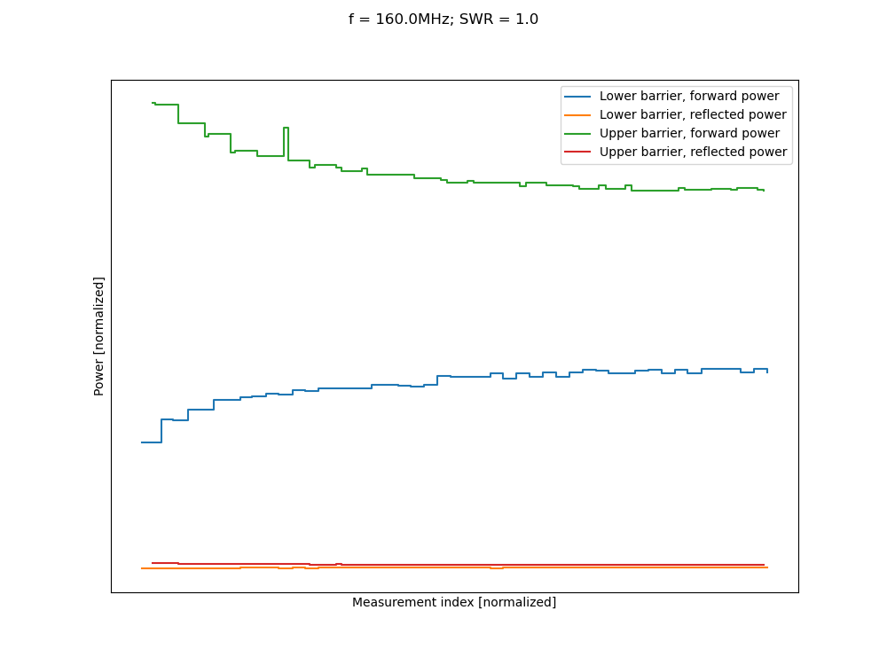

# MULTIPAC testbench
This library is designed to post-treat the data from the MULTIPAC multipactor test bench at LPSC, Grenoble, France.

## Installation
For installation instructions, see `INSTALL.md`.

## Documentation
Documentation is available at following link: https://adrienplacais.github.io/multipac_testbench/html/index.html

## Quick tour of available studies
### Plot what the probes measured, precise when multipactor happened

### Reconstruct and animate electric field along coaxial line, as well as multipactor current probes

### Represent evolution of multipacting thresholds with every power cycle
As for now (`v1.2.0`), only one power or electric field probe can be plotted at a time.

